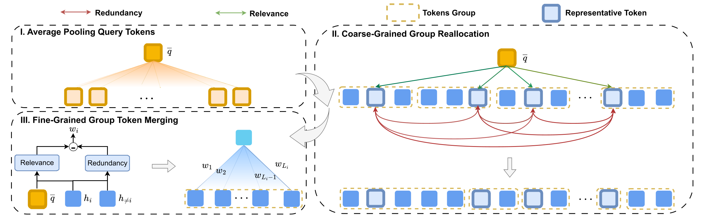
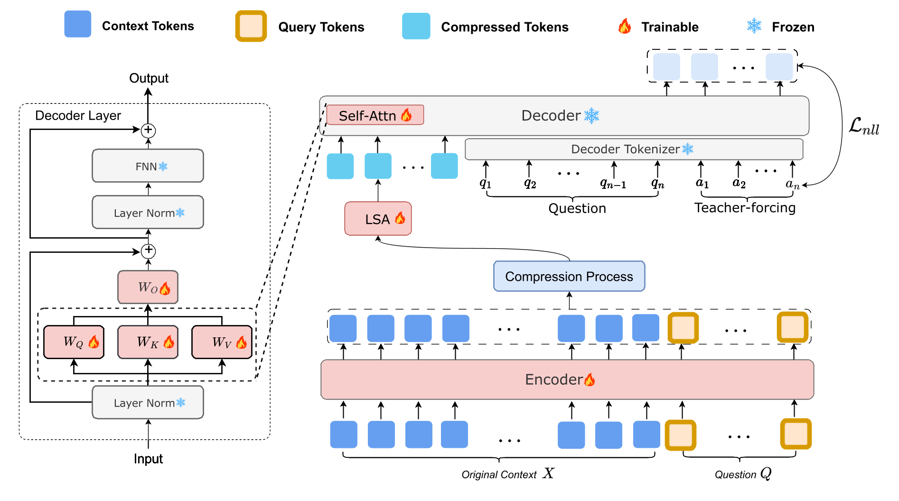
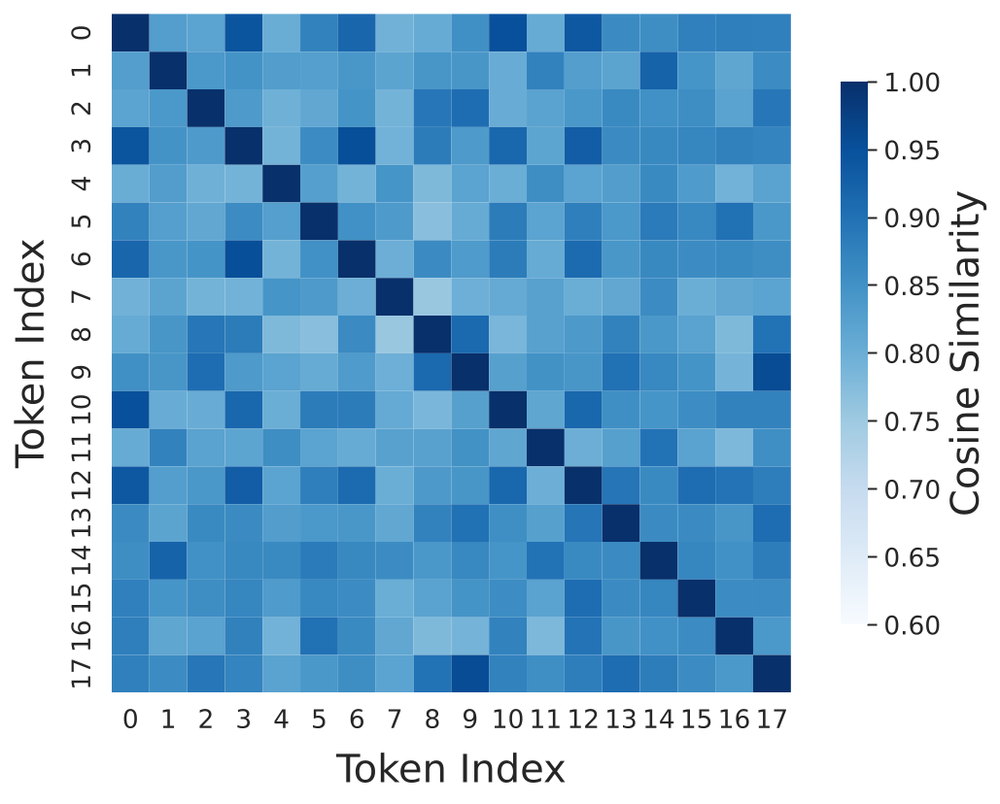
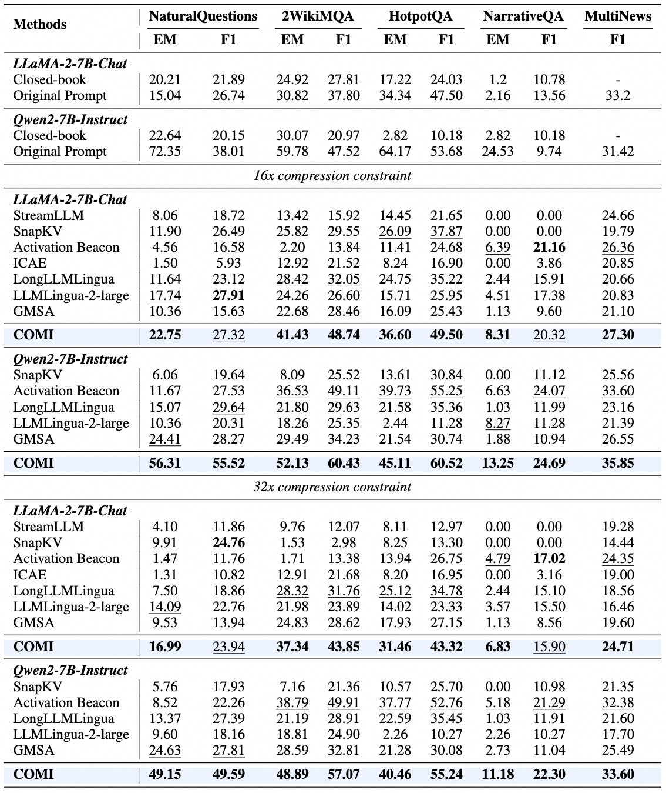

<div align="center">

<h2>COMI: Coarse-to-fine Context Compression via Marginal Information Gain</h2>

<p>
  <a href="https://scholar.google.com/citations?user=v7oMH04AAAAJ&hl=zh-CN">Jiwei Tang</a><sup>1,2</sup> · 
  Shilei Liu<sup>2</sup> · 
  Zhicheng Zhang<sup>1</sup> · 
  Yujin Yuan<sup>2</sup> · 
  Libin Zheng<sup>3,†</sup> · 
  Wenbo Su<sup>2</sup> · 
  Bo Zheng<sup>2,†</sup>
</p>
<p>
  <sup>1</sup> Tsinghua University · <sup>2</sup> Future Living Lab of Alibaba · <sup>3</sup> Sun Yat-sen University· <sup>†</sup> Corresponding Author
</p>

</div>

<div align="center">
  <a href="https://iclr.cc/virtual/2026/poster/">
    
  </a>
  <a href='https://arxiv.org/abs/2602.01719'></a>
  <a href='https://huggingface.co/datasets/Twwilght/RAM-NQ'></a>
</div>

This is the official implementation for our **ICLR 2026** paper "COMI: Coarse-to-fine Context Compression via Marginal Information Gain". Our work introduces a context compression method that jointly optimizes semantic relevance and diversity through Marginal Information Gain (MIG), enabling effective long-context processing under high compression rates (up to 32×) while eliminating redundant information.

<div align="center">
  
  <p>Compression Process of COMI.</p>
</div>

<div align="center">
  
  <p>Training Process of COMI.</p>
</div>

## Release
- [02/12] Initial release of the paper and project page.
- [06/29] Added the current training, inference, evaluation, and test workflow.

## Motivation
Existing task-aware compression methods focus solely on relevance to the query, ignoring semantic redundancy among retained tokens—leading to accumulation of *"relevant but redundant"* content that misleads LLMs.

<div align="center">
  
  <p>Top Query-Related Tokens Similarity.</p>
</div>

We propose:
- **Marginal Information Gain (MIG)**: A novel metric defined as *relevance to query minus semantic redundancy with other units*, jointly optimizing information value and diversity
- **Coarse-to-Fine Compression Strategy**:
  - **Coarse-Grained Group Reallocation**: Dynamically assigns compression rates across context segments based on inter-group MIG
  - **Fine-Grained Token Merging**: Fuses tokens within groups using intra-group MIG-weighted averaging to preserve key semantics while eliminating redundancy

## Main Results
COMI achieves superiority performance across QA and summarization tasks under high compression rates:
<div align="center">
  
</div>

## Implementation Overview

The current implementation uses an encoder-decoder architecture built from the same causal language model:

1. The encoder converts the long context and query into hidden representations.
2. Coarse-grained MIG scoring reallocates the number of retained units among context groups according to query relevance and inter-group redundancy.
3. Fine-grained MIG-weighted merging compresses tokens inside each group while reducing redundant information.
4. An optional LSA memory-fusion module transforms the compressed memories before they are consumed by the decoder.
5. The decoder generates the answer from the compressed memories and query. The default training setup fully tunes the encoder and LSA module while applying LoRA to the decoder.

`merge_size` controls the approximate compression ratio: one memory representation is produced for each group of tokens. The implementation also supports randomly sampling from several merge sizes during training.

## Environment Setup

The project is designed for NVIDIA GPUs, BF16, and FlashAttention 2. A reference environment matching the current GMSA stack is:

```bash
conda create -n ram python=3.10 -y
conda activate ram

pip install torch==2.4.0 torchvision==0.19.0 torchaudio==2.4.0 --index-url https://download.pytorch.org/whl/cu118
pip install \
  transformers==5.1.0 datasets==4.3.0 peft==0.13.0 \
  deepspeed==0.18.7 accelerate==1.13.0 safetensors==0.7.0 \
pip install flash-attn==2.6.3 --no-build-isolation
```

## Data Format

Training and evaluation data are JSONL files with one object per line:

```json
{
  "input": "Long context text...",
  "prompt": "Question text...",
  "answer": ["reference answer", "optional alternative answer"]
}
```

- `input`: long source context.
- `prompt`: task query or question.
- `answer`: either a string or a non-empty list of reference strings. Training uses the first reference; evaluation scores against the best matching reference.

Override `TRAIN_FILE` and `TEST_FILE` when using another location.

## Training

Run the training script:

```bash
bash train.sh
```

`train.sh` is configured as a quick debug launcher: it passes `--debug_data True`.


## Inference and Evaluation

Set `RESTORE_FROM` to a checkpoint directory or a supported checkpoint file (`model.safetensors`, `adapter_model.safetensors`, or `pytorch_model.bin`):

```bash
bash test.sh
```

Multi-GPU evaluation uses `NUM_GPUS` and splits samples across ranks.

Results are written under `${OUTPUT_DIR}/eval_result/`:

- `nq_inference_results_<sample-count|all>_<merge-size>.jsonl`: context, question, prediction, references, and sample identifier.
- `nq_inference_metrics_<sample-count|all>_<merge-size>.json`: total sample count, average EM, and average F1.

## Main Launcher Variables

| Variable | Training default | Description |
| --- | --- | --- |
| `MODEL_NAME` | `Qwen/Qwen3-4B-Instruct-2507` | Hugging Face model path or identifier. |
| `TRAIN_FILE` | `/path/to/train.jsonl` | Training JSONL. |
| `TEST_FILE` | `/path/to/test.jsonl` | Evaluation JSONL. |
| `OUTPUT_DIR` | `./output` | `./output` | Checkpoint and evaluation root. |
| `RESTORE_FROM` | — | Checkpoint directory/file; set this explicitly for normal evaluation. |
| `MERGE_SIZE` | `16` | Tokens represented by one compressed memory unit. |
| `SEGMENT_SIZE` | `30000` | Long-context segment size. |
| `NUM_GPUS` | `2` | Number of `torchrun` workers. |
| `MAX_STEPS` | `10000` | Maximum training steps. |
| `NUM_SAMPLES` | `100` | Evaluation sample count. |

Additional model switches such as `--coarse_grained_on`, `--fine_grained_on`, `--redun_coarse`, `--redun_fine`, LoRA targets, and trainability controls can be passed to `train.sh`.


## BibTeX
If you find our repo helpful, please consider leaving a star and cite our paper

```bibtex
@misc{tang2026comicoarsetofinecontextcompression,
      title={COMI: Coarse-to-fine Context Compression via Marginal Information Gain}, 
      author={Jiwei Tang and Shilei Liu and Zhicheng Zhang and Yujin Yuan and Libin Zheng and Wenbo Su and Bo Zheng},
      year={2026},
      eprint={2602.01719},
      archivePrefix={arXiv},
      primaryClass={cs.CL},
      url={https://arxiv.org/abs/2602.01719}, 
}
```
